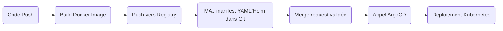

# Scaling n8n: Building a Production-Ready Multi-Environment Architecture

L'objectif de ce projet HUB est de comprendre :

- pourquoi rendre n8n scalable,
- à quoi servent chaque composant,
- comment l'architecture et les automatismes apportent robustesse, souplesse et évolutivité.

## 1. Introduction : Pourquoi industrialiser et rendre scalable n8n ?

### Qu'est-ce que n8n ?

n8n est une plateforme open source qui permet d'automatiser des tâches entre différentes applications.  
Exemple : Si tu reçois un mail, créer automatiquement une tâche dans Trello, ajouter une ligne dans un Google Sheet, etc.

### Pourquoi le rendre scalable ?

Par défaut, n8n fonctionne bien pour de petits besoins, mais si de nombreux utilisateurs/services veulent l'utiliser en même temps, ça peut devenir lent ou instable.

Rendre n8n scalable ("évolutif") veut dire qu'on adapte l'application pour qu'elle puisse supporter plus d'utilisateurs, plus de tâches, sans planter.

C'est essentiel pour la fiabilité en entreprise : cela évite que tout s'arrête si beaucoup de workflows tournent en même temps, et cela permet d'ajouter facilement de la puissance (des serveurs) selon la charge.

Et surtout : un déploiement professionnel doit aussi pouvoir tester les nouveautés sans tout casser ! C'est pour ça qu'on sépare dev, staging, prod.

## 2. Objectifs du projet

- Comprendre les enjeux "scalabilité", qualité et robustesse pour une plateforme d'automatisation.  
- Être capable de déployer n8n pour plusieurs environnements : développement (dev), validation/préproduction (staging), production (prod).  
- Acquérir de bonnes pratiques : sécurité, monitoring, sauvegarde, industrialisation (CI/CD, GitOps).  
- Permettre à plusieurs équipes (ou étudiants !) de collaborer sans se marcher dessus.

## 3. Architecture cible

L'architecture vise à répondre aux besoins :

- Supporter beaucoup d'utilisateurs et de tâches à automatiser,  
- Éviter qu'une partie plante tout le reste,  
- Pouvoir surveiller et corriger tout problème rapidement.

### Composants

- **Load Balancer** : "Gardien du portail" qui répartit les requêtes entre plusieurs serveurs n8n.  
- **Pods n8n API** : Le "cerveau", ils reçoivent les demandes, lancent les workflows.  
- **Pods n8n Worker** : Ce sont "les bras" : ils exécutent les étapes lourdes des workflows, ce qui évite de bloquer le cerveau.  
- **PostgreSQL** : La "mémoire" : tout l'historique, la config, les workflows sont stockés là.  
- **Redis (queue)** : "La file d'attente" qui organise les tâches à traiter : permet que les workers les prennent dans l'ordre, évite les collisions.  
- **Monitoring (Prometheus, Grafana)** : "Tableau de bord", pour surveiller si tout va bien, réagir vite si soucis.

## 4. Test de Scalabilité : Guide Complet avec Captures d'Écran

Cette section présente un guide étape par étape pour tester et valider la scalabilité de l'architecture n8n.

### 4.1. Prérequis

Avant de commencer les tests, assurez-vous d'avoir :

- Docker installé et fonctionnel
- Kubernetes cluster accessible (local ou cloud)
- kubectl configuré
- L'image `scalable-n8n/platform:latest` buildée

```bash
# Vérifier Docker
docker --version

# Vérifier Kubernetes
kubectl cluster-info

# Builder l'image si ce n'est pas fait
docker build -t scalable-n8n/platform:latest .
```

### 4.2. Déploiement Local pour Tests

#### Étape 1 : Déployer les composants de base

```bash
# Appliquer la configuration dev
kubectl apply -k k8s/overlays/dev/

# Vérifier les deployments
kubectl get pods -n n8n-dev
```

**Capture d'écran attendue :**

```NAME                             READY   STATUS    RESTARTS   AGE
dev-n8n-api-xxx                  1/1     Running   0          2m
dev-n8n-worker-xxx               1/1     Running   0          2m
dev-n8n-worker-yyy               1/1     Running   0          2m
dev-postgresql-0                 1/1     Running   0          2m
dev-redis-xxx                    1/1     Running   0          2m
```

#### Étape 2 : Créer les secrets

```bash
# Exécuter le script de création des secrets
source create-secrets.sh
create_secrets "n8n-dev" "dev-"

# Vérifier les secrets
kubectl get secrets -n n8n-dev
```

#### Étape 3 : Accéder à l'interface n8n

```bash
# Port-forward vers l'API n8n
kubectl port-forward -n n8n-dev svc/dev-n8n-api 8080:80
```

Puis ouvrir [http://localhost:8080](http://localhost:8080) dans le navigateur.

### 4.3. Test de Scalabilité : Création de Workflows

#### Test 1 : Workflows de charge

Créer dans l'interface n8n ces workflows :

##### Workflow 1 - "Load Test API"

- Schedule Trigger : toutes les 10 secondes
- HTTP Request : GET vers httpbin.org/delay/2
- Set Node : ajouter timestamp

##### Workflow 2 - "Load Test Database"

- Schedule Trigger : toutes les 15 secondes  
- HTTP Request : POST vers httpbin.org/post
- Set Node : manipuler données

##### Workflow 3 - "Load Test Heavy"

- Schedule Trigger : toutes les 20 secondes
- Code Node : boucle qui calcule des nombres premiers
- HTTP Request : vers une API externe

### 4.4. Observation de la Répartition de Charge

#### Commandes de monitoring en temps réel

```bash
# Terminal 1 : Observer les logs des workers
kubectl logs -n n8n-dev -l app=n8n-worker -f

# Terminal 2 : Observer l'utilisation des resources
kubectl top pods -n n8n-dev

# Terminal 3 : Observer la distribution des tâches
kubectl logs -n n8n-dev -l app=n8n-worker -f | grep -E "(Executing|Processing|Workflow)"
```

**Résultats attendus dans les logs :**

```[Worker dev-n8n-worker-abc] Processing workflow: Load Test API
[Worker dev-n8n-worker-def] Processing workflow: Load Test Database  
[Worker dev-n8n-worker-abc] Completed workflow execution
[Worker dev-n8n-worker-def] Processing workflow: Load Test Heavy
```

### 4.5. Test de Résilience

#### Test 1 : Suppression d'un worker

```bash
# Identifier les workers
kubectl get pods -n n8n-dev -l app=n8n-worker

# Supprimer un worker
kubectl delete pod -n n8n-dev $(kubectl get pods -n n8n-dev -l app=n8n-worker -o jsonpath='{.items[0].metadata.name}')

# Observer la récupération automatique
kubectl get pods -n n8n-dev -w
```

**Comportement attendu :**

1. Le pod supprimé passe en `Terminating`
2. Un nouveau pod est créé automatiquement
3. Les workflows continuent sur les autres workers
4. Aucune perte de données

#### Test 2 : Montée en charge

```bash
# Augmenter le nombre de workers
kubectl scale deployment dev-n8n-worker --replicas=4 -n n8n-dev

# Observer la montée en charge
kubectl get pods -n n8n-dev -l app=n8n-worker -w
```

### 4.6. Métriques et Validation

#### Commandes de validation

```bash
# Vérifier que tous les pods sont running
kubectl get pods -n n8n-dev

# Vérifier l'état des services
kubectl get svc -n n8n-dev

# Tester la connectivité API
curl http://localhost:8080/healthz

# Observer les métriques de performance
kubectl top nodes
kubectl top pods -n n8n-dev
```

#### Critères de validation

✅ **Scalabilité validée si :**

- Les workflows s'exécutent en parallèle sur différents workers
- La suppression d'un worker ne stoppe pas l'exécution
- L'ajout de workers améliore les performances
- Aucune perte de données lors des incidents

✅ **Performance validée si :**

- Temps de réponse API < 200ms
- Utilisation CPU < 70% par pod
- Utilisation RAM < 80% par pod
- Tous les workflows s'exécutent dans les délais

### 4.7. Nettoyage

```bash
# Supprimer l'environnement de test
kubectl delete namespace n8n-dev

# Arrêter le port-forward
pkill -f "port-forward"
```

### 4.8. Captures d'Écran Recommandées

Pour documenter les tests, prendre des captures de :

1. **Interface n8n** avec les 3 workflows créés et actifs
2. **Terminal avec logs des workers** montrant la répartition
3. **Commande `kubectl get pods`** avant et après suppression d'un worker
4. **Commande `kubectl top pods`** montrant l'utilisation des ressources
5. **Graphique Grafana** (si monitoring installé) des métriques

### 4.9. Troubleshooting

**Problèmes courants :**

- **Pods en CrashLoopBackOff** : Vérifier les secrets et variables d'environnement
- **Workers ne reçoivent pas de tâches** : Vérifier la configuration Redis
- **Lenteur générale** : Augmenter les ressources CPU/RAM des pods

Cette approche méthodique permet de prouver concrètement que l'architecture n8n est scalable et résiliente !

```bash
# Builder l'image enterprise
docker build -t scalable-n8n/platform:latest .

# Tagger avec une version spécifique 
docker tag scalable-n8n/platform:latest scalable-n8n/platform:1.0.0
```

Cette image intègre des optimisations pour les déploiements à grande échelle avec monitoring et métriques activés.

## 5. Schémas complémentaires pour pipeline CI/CD & GitOps

### Schéma 1 – Pipeline CI/CD (GitLab)



## 6. Gestion des environnements multiples

- Namespace Kubernetes par env : dev, staging, prod.
- Configurations spécifiques par environnement (values-dev.yaml, values-prod.yaml, …).
- Séparation stricte pour éviter qu'un bug en dev n'impacte la prod.
- CI/CD et GitOps : chaque branche ou chaque "PR" déclenche un déploiement dans le bon environnement.

## 7. Sécurité (vulgarisée)

- Authentification obligatoire : on protège même l'environnement de dev.
- TLS/HTTPS partout pour éviter que des mots de passe voyagent en clair.
- Secrets : toujours dans Kubernetes, jamais dans le dépôt git.
- Limiter les droits d'accès : chaque service/pod n'a que ce qu'il doit avoir.

## 8. Monitoring, logs, maintenance

- Prometheus : récupère comment chaque service "se sent" (mémoire, CPU, erreurs…).
- Grafana : affichage de tout cela en graphiques (pas obligatoire).
- Backups réguliers de la base PostgreSQL.
- Logs centralisés pour retrouver qui a fait quoi, et réagir en cas de bug.

## 9. Conclusion : résumé et intérêt

Rendre scalable n8n = permettre à beaucoup de workflows de tourner, pour de nombreux utilisateurs, sans crainte de plantage et avec la possibilité de grandir !

Séparation dev/staging/prod, CI/CD & GitOps = confiance, sécurité, collaboration, historique des modifications, rollback faciles.

Objectif : Comprendre comment déployer une application professionnelle de manière robuste, apprendre à industrialiser un projet, assurer qualité et résilience, tout en gardant de la souplesse pour innover ou corriger.

## 10. Vérification de la scalabilité

Une fois l'architecture déployée, il est important de vérifier que la scalabilité fonctionne correctement. Voici comment procéder étape par étape :

### 10.1. Création de workflows de test

Créez plusieurs workflows avec des exécutions périodiques :

1. Connectez-vous à l'interface n8n via : [http://localhost:8080](http://localhost:8080) (en utilisant port-forward)
2. Créez au moins 3 workflows différents avec les caractéristiques suivantes :
   - Workflow 1 : Schedule Trigger (toutes les 15 secondes) + HTTP Request (délai 2s)
   - Workflow 2 : Schedule Trigger (toutes les 20 secondes) + HTTP Request (délai 3s)
   - Workflow 3 : Schedule Trigger (toutes les 30 secondes) + HTTP Request (délai 4s)
3. Activez tous ces workflows pour qu'ils s'exécutent automatiquement

### 10.2. Observer la distribution des tâches

Pour observer comment les tâches sont réparties entre les workers :

```bash
# Visualiser tous les logs des workers en temps réel
kubectl logs -n n8n-dev -l app=n8n-worker -f

# Identifier les différents workers
kubectl logs -n n8n-dev -l app=n8n-worker | grep "Host ID" || echo "Aucun ID d'hôte trouvé"

# Voir uniquement les exécutions de workflows
kubectl logs -n n8n-dev -l app=n8n-worker -f | grep -i "executing" || grep -i "workflow"
```

### 10.3. Vérifier la résilience du système

Pour tester que le système continue à fonctionner même en cas de défaillance :

```bash
# 1. Dans un terminal, observez les logs des workers
kubectl logs -n n8n-dev -l app=n8n-worker -f

# 2. Dans un autre terminal, supprimez un pod worker
kubectl delete pod -n n8n-dev $(kubectl get pods -n n8n-dev -l app=n8n-worker -o jsonpath='{.items[0].metadata.name}')

# 3. Observez que :
#   - Les workflows continuent à s'exécuter sur l'autre worker
#   - Un nouveau pod worker est automatiquement créé
kubectl get pods -n n8n-dev -w
```

Votre architecture n8n est correctement scalable si :

✅ Les workflows s'exécutent en parallèle sur différents workers  
✅ Quand un worker tombe en panne, les autres continuent à traiter les tâches  
✅ Kubernetes recrée automatiquement le worker manquant  
✅ La base de données PostgreSQL et Redis sont stables sous charge

Toutes ces observations confirment que votre déploiement n8n est robuste, résilient et prêt pour une utilisation en production.
