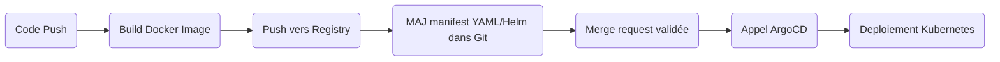

# Scaling n8n: Building a Production-Ready Multi-Environment Architecture

L’objectif de ce projet HUB est de comprendre :

- pourquoi rendre n8n scalable,
- à quoi servent chaque composant,
- comment l’architecture et les automatismes apportent robustesse, souplesse et évolutivité.

## 1. Introduction : Pourquoi industrialiser et rendre scalable n8n ?

### Qu’est-ce que n8n ?

n8n est une plateforme open source qui permet d’automatiser des tâches entre différentes applications.  
Exemple : Si tu reçois un mail, créer automatiquement une tâche dans Trello, ajouter une ligne dans un Google Sheet, etc.

### Pourquoi le rendre scalable ?

Par défaut, n8n fonctionne bien pour de petits besoins, mais si de nombreux utilisateurs/services veulent l'utiliser en même temps, ça peut devenir lent ou instable.

Rendre n8n scalable (“évolutif”) veut dire qu’on adapte l’application pour qu’elle puisse supporter plus d’utilisateurs, plus de tâches, sans planter.

C’est essentiel pour la fiabilité en entreprise : cela évite que tout s’arrête si beaucoup de workflows tournent en même temps, et cela permet d’ajouter facilement de la puissance (des serveurs) selon la charge.

Et surtout : un déploiement professionnel doit aussi pouvoir tester les nouveautés sans tout casser ! C’est pour ça qu’on sépare dev, staging, prod.

## 2. Objectifs du projet

- Comprendre les enjeux “scalabilité”, qualité et robustesse pour une plateforme d’automatisation.  
- Être capable de déployer n8n pour plusieurs environnements : développement (dev), validation/préproduction (staging), production (prod).  
- Acquérir de bonnes pratiques : sécurité, monitoring, sauvegarde, industrialisation (CI/CD, GitOps).  
- Permettre à plusieurs équipes (ou étudiants !) de collaborer sans se marcher dessus.

## 3. Architecture cible

L’architecture vise à répondre aux besoins :

- Supporter beaucoup d’utilisateurs et de tâches à automatiser,  
- Éviter qu’une partie plante tout le reste,  
- Pouvoir surveiller et corriger tout problème rapidement.

### Composants

- **Load Balancer** : “Gardien du portail” qui répartit les requêtes entre plusieurs serveurs n8n.  
- **Pods n8n API** : Le “cerveau”, ils reçoivent les demandes, lancent les workflows.  
- **Pods n8n Worker** : Ce sont “les bras” : ils exécutent les étapes lourdes des workflows, ce qui évite de bloquer le cerveau.  
- **PostgreSQL** : La “mémoire” : tout l’historique, la config, les workflows sont stockés là.  
- **Redis (queue)** : “La file d’attente” qui organise les tâches à traiter : permet que les workers les prennent dans l’ordre, évite les collisions.  
- **Monitoring (Prometheus, Grafana)** : “Tableau de bord”, pour surveiller si tout va bien, réagir vite si soucis.

## 4. Les étapes détaillées : comment déployer le tout

### 4.1. Conteneurisation de n8n

But : simplifier le transport et l’exécution de n8n partout.
On utilise Docker pour “emballer” n8n avec tout le nécessaire.

Pour débutant : Tu peux aussi utiliser l’image “prête à l’emploi” officielle sur DockerHub :
`n8nio/n8n`

```bash
docker build -t monrepo/n8n:custom .
```

Pas besoin de modifier le code pour commencer : commence avec l’image officielle, puis tu amélioreras au besoin !

### 4.2. Déployer la base PostgreSQL

Cœur de la persistance.

On installe une base PostgreSQL, soit en service cloud (RDS, GCP…), soit sur Kubernetes via Helm Chart.

```bash
helm install postgres oci://registry-1.docker.io/bitnamicharts/postgresql \
  --set global.postgresql.auth.postgresPassword=myPassword \
  --set primary.persistence.enabled=true
```

À savoir : PostgreSQL sert à sauvegarder tous tes workflows, utilisateurs, logs...

### 4.3. Ajouter Redis pour la file d’attente

Redis répartit les tâches pour que de nombreux workers puissent bosser en parallèle.

```bash
helm repo add bitnami https://charts.bitnami.com/bitnami
helm install redis bitnami/redis
```

L’intérêt : Si un workflow est long, il ne bloque pas les autres, tous avancent sans attendre !

### 4.4. Configuration des variables d’environnement

Séparer la configuration du code.

On utilise des variables pour tout : accès DB, Redis, mots de passe...

```env
N8N_BASIC_AUTH_ACTIVE=true
N8N_BASIC_AUTH_USER=admin
N8N_BASIC_AUTH_PASSWORD=SuperSecret
DB_TYPE=postgresdb
DB_POSTGRESDB_HOST=postgresql.xxx.yyy
DB_POSTGRESDB_PORT=5432
DB_POSTGRESDB_USER=n8n
DB_POSTGRESDB_PASSWORD=<secret>
QUEUE_BULL_REDIS_HOST=redis-master
QUEUE_BULL_REDIS_PORT=6379
```

**Conseil** : ne mets jamais les mots de passe en clair dans le code, utilise les Kubernetes Secrets.

### 4.5. Déployer sur Kubernetes

Kubernetes permet de gérer automatiquement l’état des services : ajout/suppression de serveurs, redémarrage auto, etc.

Exemple : déployer 2 serveurs n8n API, 3 Workers.

```yaml
apiVersion: apps/v1
kind: Deployment
metadata:
  name: n8n-api
spec:
  replicas: 2
  # ...
---
kind: Deployment
metadata:
  name: n8n-worker
spec:
  replicas: 3
  # ...
```

### 4.6. GitOps et ArgoCD

But : tout ce qui concerne la configuration/déploiement doit être versionné (dans Git), validé et déployé automatiquement.

ArgoCD surveille ton repo pour appliquer et synchroniser chaque changement.

Avantage : tu peux toujours revenir à une ancienne version si tu fais une erreur !

### 4.7. CI/CD avec GitLab

Automatise ce qui peut l’être : build, tests, déploiement...

Pipeline typique :

- On pousse une modification du workflow (ou config),
- Build de l’image Docker,
- Push sur un registre,
- Mise à jour des manifests Kubernetes,
- ArgoCD applique la modification,
- Notification de succès/échec.

Tout est régi par des “pipelines” qui évitent les erreurs manuelles !

## 5. Schémas complémentaires pour pipeline CI/CD & GitOps

### Schéma 1 – Pipeline CI/CD (GitLab)



### Exemple de fichier Pipeline (.gitlab-ci.yml)

```yaml
stages:
  - build
  - push
  - deploy

variables:
  IMAGE_TAG: $CI_REGISTRY_IMAGE:$CI_COMMIT_SHA

build:
  stage: build
  script:
    - docker build -t $IMAGE_TAG .
  only:
    - main
    - develop

push:
  stage: push
  script:
    - echo $CI_REGISTRY_PASSWORD | docker login -u $CI_REGISTRY_USER --password-stdin $CI_REGISTRY
    - docker push $IMAGE_TAG
  only:
    - main
    - develop

update-manifest:
  stage: deploy
  script:
    - sed -i "s|image:.*|image: $IMAGE_TAG|" k8s/deployment.yaml
    - git config --global user.email "ci@example.com"
    - git config --global user.name "GitLab CI"
    - git add k8s/deployment.yaml
    - git commit -m "Update image to $IMAGE_TAG"
    - git push origin HEAD:main
  only:
    - main
```

## 6. Gestion des environnements multiples

- Namespace Kubernetes par env : dev, staging, prod.
- Configurations spécifiques par environnement (values-dev.yaml, values-prod.yaml, …).
- Séparation stricte pour éviter qu’un bug en dev n’impacte la prod.
- CI/CD et GitOps : chaque branche ou chaque “PR” déclenche un déploiement dans le bon environnement.

## 7. Sécurité (vulgarisée)

- Authentification obligatoire : on protège même l’environnement de dev.
- TLS/HTTPS partout pour éviter que des mots de passe voyagent en clair.
- Secrets : toujours dans Kubernetes, jamais dans le dépôt git.
- Limiter les droits d’accès : chaque service/pod n’a que ce qu’il doit avoir.

## 8. Monitoring, logs, maintenance

- Prometheus : récupère comment chaque service “se sent” (mémoire, CPU, erreurs…).
- Grafana : affichage de tout cela en graphiques (pas obligatoire).
- Backups réguliers de la base PostgreSQL.
- Logs centralisés pour retrouver qui a fait quoi, et réagir en cas de bug.

## 9. Conclusion : résumé et intérêt

Rendre scalable n8n = permettre à beaucoup de workflows de tourner, pour de nombreux utilisateurs, sans crainte de plantage et avec la possibilité de grandir !

Séparation dev/staging/prod, CI/CD & GitOps = confiance, sécurité, collaboration, historique des modifications, rollback faciles.

Objectif : Comprendre comment déployer une application professionnelle de manière robuste, apprendre à industrialiser un projet, assurer qualité et résilience, tout en gardant de la souplesse pour innover ou corriger

## 10. Vérification de la scalabilité

Une fois l'architecture déployée, il est important de vérifier que la scalabilité fonctionne correctement. Voici comment procéder étape par étape :

### 10.1. Création de workflows de test

Créez plusieurs workflows avec des exécutions périodiques :

1. Connectez-vous à l'interface n8n via : `http://localhost:8080` (en utilisant port-forward)
2. Créez au moins 3 workflows différents avec les caractéristiques suivantes :
   - Workflow 1 : Schedule Trigger (toutes les 15 secondes) + HTTP Request (délai 2s)
   - Workflow 2 : Schedule Trigger (toutes les 20 secondes) + HTTP Request (délai 3s)
   - Workflow 3 : Schedule Trigger (toutes les 30 secondes) + HTTP Request (délai 4s)
3. Activez tous ces workflows pour qu'ils s'exécutent automatiquement

### 10.2. Observer la distribution des tâches

Pour observer comment les tâches sont réparties entre les workers :

```bash
# Visualiser tous les logs des workers en temps réel
kubectl logs -n n8n-dev -l app=n8n-worker -f

# Identifier les différents workers
kubectl logs -n n8n-dev -l app=n8n-worker | grep "Host ID" || echo "Aucun ID d'hôte trouvé"

# Voir uniquement les exécutions de workflows
kubectl logs -n n8n-dev -l app=n8n-worker -f | grep -i "executing" || grep -i "workflow"
```

### 10.3. Vérifier la résilience du système

Pour tester que le système continue à fonctionner même en cas de défaillance :

```bash
# 1. Dans un terminal, observez les logs des workers
kubectl logs -n n8n-dev -l app=n8n-worker -f

# 2. Dans un autre terminal, supprimez un pod worker
kubectl delete pod -n n8n-dev $(kubectl get pods -n n8n-dev -l app=n8n-worker -o jsonpath='{.items[0].metadata.name}')

# 3. Observez que :
#   - Les workflows continuent à s'exécuter sur l'autre worker
#   - Un nouveau pod worker est automatiquement créé
kubectl get pods -n n8n-dev -w
```

## 11. Monitoring avancé : Prometheus & Grafana

### Pourquoi utiliser Prometheus et Grafana ?

- **Prometheus** collecte automatiquement les métriques de tous les composants Kubernetes (CPU, RAM, pods, nodes, services, etc.) et des applications qui exposent un endpoint `/metrics` (comme n8n).
- **Grafana** permet de visualiser ces métriques sous forme de dashboards interactifs, d’alertes et de graphiques personnalisés.
- Cela permet de :
  - Surveiller la santé du cluster et des applications
  - Détecter les anomalies ou surcharges
  - Analyser les performances et l’utilisation des ressources
  - Créer des alertes (mail, Slack, etc.) en cas de problème

### Installation rapide sur Kubernetes (avec Helm)

```bash
# Ajouter les repositories Helm
helm repo add prometheus-community https://prometheus-community.github.io/helm-charts
helm repo add grafana https://grafana.github.io/helm-charts
helm repo update

# Installer Prometheus + Grafana (stack complète)
helm install prometheus prometheus-community/kube-prometheus-stack --namespace monitoring --create-namespace
```

### Accédé à Grafana

```bash
kubectl -n monitoring port-forward svc/prometheus-grafana 3000:80
```

Puis ouvre [http://localhost:3000](http://localhost:3000) dans ton navigateur.

Pour récupérer le mot de passe admin Grafana :

```bash
kubectl -n monitoring get secrets prometheus-grafana -o jsonpath="{.data.admin-password}" | base64 -d ; echo
```

Login : `admin`

### Utilisation de base

- Des dashboards Kubernetes et Prometheus sont déjà présents dans Grafana (menu “Dashboards” > “Browse”).
- Pour explorer les métriques : menu “Explore”, choisis la source “Prometheus” et tape une requête (ex : `up`, `kube_pod_container_status_ready`, etc.).
- Pour monitorer n8n, assure-toi que l’option `N8N_METRICS=true` est activée (déjà dans la config) et ajoute un dashboard n8n (import ou création manuelle).

### Allé plus loin ! 

- Tu peux importer des dashboards depuis [grafana.com/dashboards](https://grafana.com/grafana/dashboards/)
- Pour monitorer n8n précisément, ajoute un ServiceMonitor ou PodMonitor pour que Prometheus scrape l’endpoint `/metrics` de n8n.
- Personnalise les alertes et notifications selon tes besoins.

Votre architecture n8n est correctement scalable si :

✅ Les workflows s'exécutent en parallèle sur différents workers  
✅ Quand un worker tombe en panne, les autres continuent à traiter les tâches  
✅ Kubernetes recrée automatiquement le worker manquant  
✅ La base de données PostgreSQL et Redis sont stables sous charge  

Toutes ces observations confirment que votre déploiement n8n est robuste, résilient et prêt pour une utilisation en production!

---

## Politique d’accès et de contribution

- **GitLab** est le dépôt principal : toutes les modifications, issues et merge requests doivent être faites sur GitLab ([lien du dépôt GitLab](https://gitlab.com/Samy83-group/n8n-scalable-architecture)).
- **GitHub** est un miroir en lecture seule, synchronisé automatiquement depuis GitLab.  
  Il sert à :
  - permettre aux étudiants de cloner ou forker le code facilement,
  - donner de la visibilité open source.
- **Ne faites jamais de modification directe sur GitHub** : toute modification doit être poussée sur GitLab pour garantir la cohérence et la synchronisation automatique.
- En cas de divergence d’historique, le dépôt GitHub sera écrasé par celui de GitLab lors du prochain mirroring.

---

## Cloner ou forker le dépôt GitHub

Pour récupérer le code et l’architecture n8n :

### Cloner en lecture seul

```bash
git clone https://github.com/Samy83990/n8n-scalable-architecture.git
```

### Forker pour travailler sur votre propre versions

1. Rendez-vous sur la page du dépôt :  
<https://github.com/Samy83990/n8n-scalable-architecture>
2. Cliquez sur le bouton **Fork** (en haut à droite).
3. Clonez ensuite votre fork :

```bash
git clone https://github.com/<votre-utilisateur>/n8n-scalable-architecture.git
```

---
